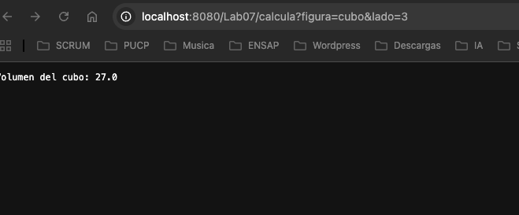
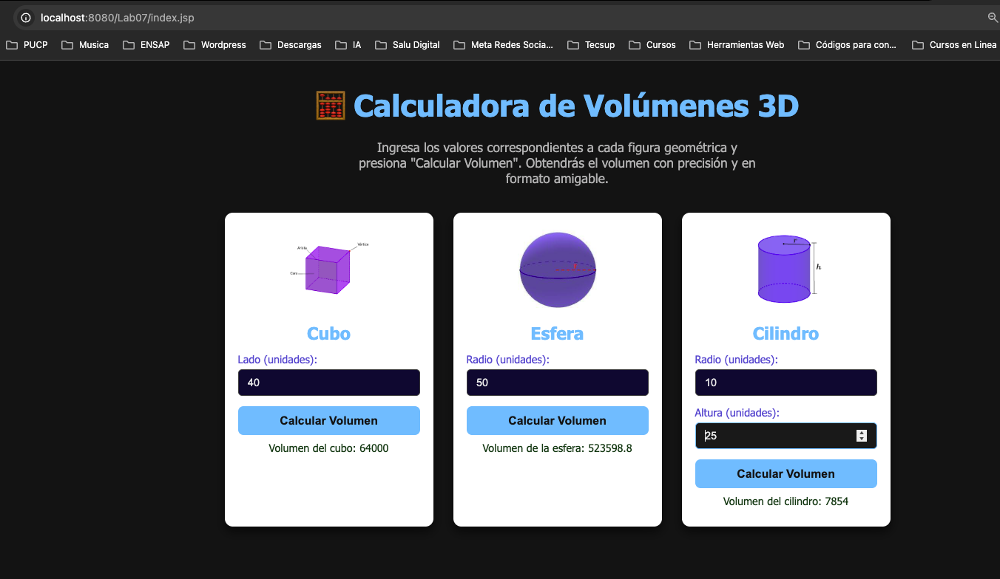

# 🧪 Calculadora de Volúmenes con Java Servlet

Este proyecto es una aplicación web simple desarrollada con **Java 17**, empaquetada como un archivo `.war` y desplegada en **Apache Tomcat 10** dentro de un contenedor **Docker**.

## 📦 Tecnologías utilizadas

- Java 17
- Maven
- Jakarta EE (Servlet 6.x)
- Tomcat 10.1
- Docker & Docker Compose
- jQuery (para peticiones AJAX)
- AJAX (para comunicación asíncrona con el servlet)
- Bootstrap (para el diseño responsivo y estilizado)


## ¿Para qué sirve AJAX?

AJAX (Asynchronous JavaScript and XML) es una técnica que permite la comunicación entre el navegador y el servidor **sin necesidad de recargar toda la página web**.

### Beneficios de usar AJAX:

- **Interacciones más rápidas y fluidas:** Envía y recibe datos en segundo plano, mejorando la experiencia del usuario.
- **Actualización parcial del contenido:** Permite actualizar solo una parte de la página web sin refrescar todo el sitio.
- **Formato flexible de datos:** Aunque su nombre menciona XML, comúnmente se usa con JSON o texto plano.
- **Mejora la interactividad:** Ideal para aplicaciones web dinámicas y responsivas.

### Ejemplo en este proyecto:

Se utiliza AJAX para enviar datos (como el lado, radio o altura de una figura geométrica) al Servlet en el backend, que calcula el volumen y devuelve el resultado. El resultado se muestra en la página sin recargarla, brindando una experiencia más rápida y amigable.

### ¿Qué hace jQuery en este proyecto?

jQuery es una biblioteca de JavaScript que simplifica la escritura de código para manipular elementos HTML y realizar llamadas AJAX. En este proyecto, jQuery se usa para enviar solicitudes AJAX al Servlet sin recargar la página, y para actualizar dinámicamente los resultados en la interfaz de usuario.


## 📄 Descripción

Este proyecto implementa una aplicación web sencilla que calcula el volumen de diferentes figuras geométricas: cubo, esfera y cilindro.

La lógica de cálculo se encuentra en un Servlet Java (`CalculaServlet`) que recibe peticiones HTTP GET con parámetros específicos.

Según la figura seleccionada (`cubo`, `esfera` o `cilindro`), el servlet procesa los datos (lado, radio, altura) y devuelve el volumen calculado como texto plano.

La interfaz web permite al usuario ingresar los valores correspondientes y muestra el resultado de forma dinámica mediante peticiones AJAX con jQuery.

## 🚀 Características

- Uso de tecnologías Java EE / Jakarta Servlet para el backend.
- Respuestas en formato texto plano para facilitar la integración con AJAX.
- Interfaz sencilla y funcional con Bootstrap y jQuery para una experiencia amigable.
- Cálculo preciso usando fórmulas matemáticas estándar para volúmenes geométricos.
- Manejo básico de validación en el frontend para evitar peticiones con datos vacíos.

## 📂 Estructura del Proyecto

- Código fuente Java en `src/main/java` con el servlet principal.
- Recursos web (CSS, imágenes, jQuery) en `src/main/webapp`.
- Archivo `index.jsp` como página principal.
- Configuración Maven para construir un archivo WAR desplegable en un servidor Tomcat.

### 🚀 Cómo compilar y desplegar

```bash
mvn clean package
docker-compose down
docker-compose build
docker-compose up -d

```

Luego, acceder en navegador a:
```bash
http://localhost:8080/Lab07/index.jsp

```
### Vistas del proyecto

- Prueba de calculo desde URL

 d
- Archivo JSP con diseño CSS en donde se aprecia el calculo
